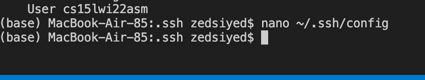
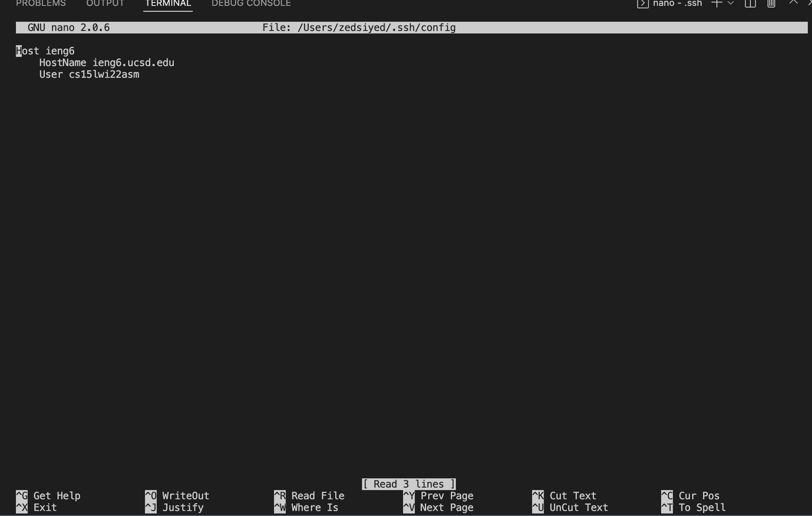
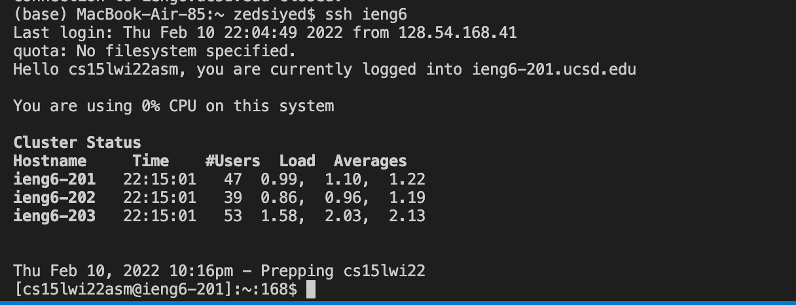
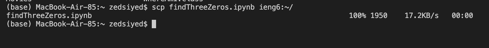
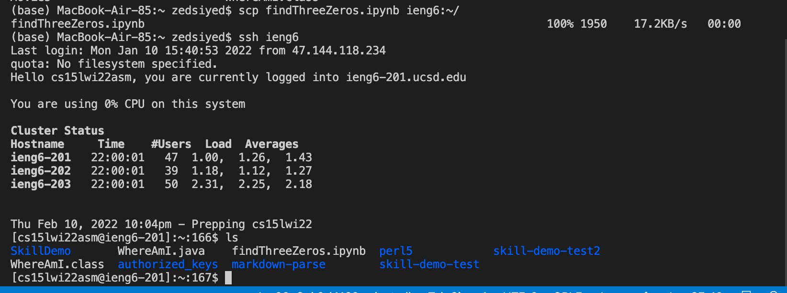

# Streamlining ssh Configuration
## Here is my .ssh/config file contents and how I edited it

Above is me calling nano to write the file contents

Above is me copying the contents after calling nano, based on my tutor's intructions

Above is me successfully using ssh ieng6 to ssh

Above is me using the scp command to move a notebook

Above shows that the notebook was successfully moved onto the remote server
