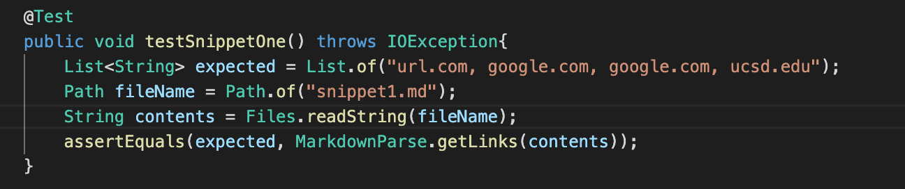
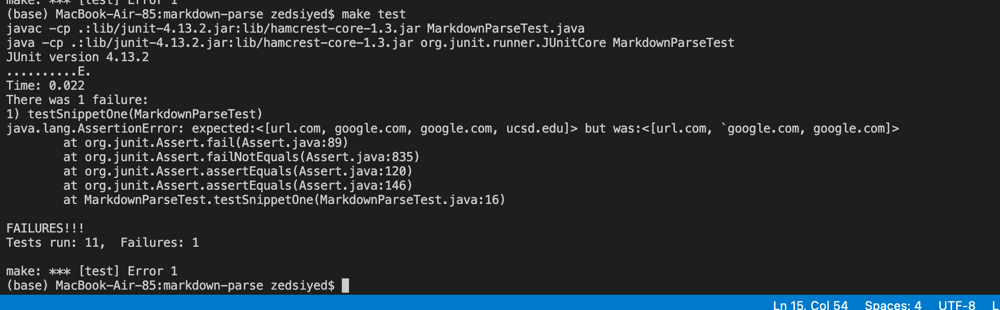
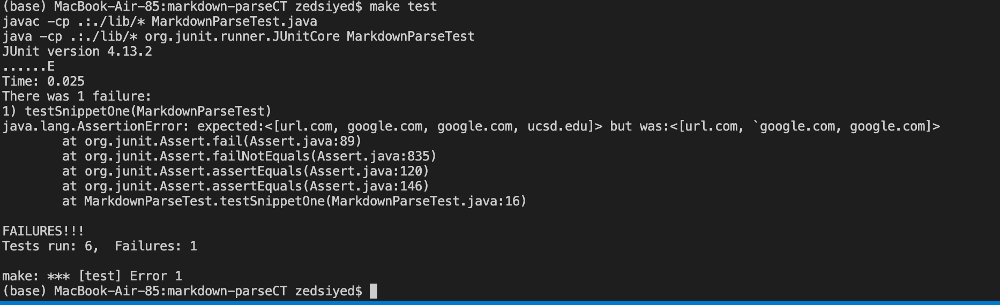
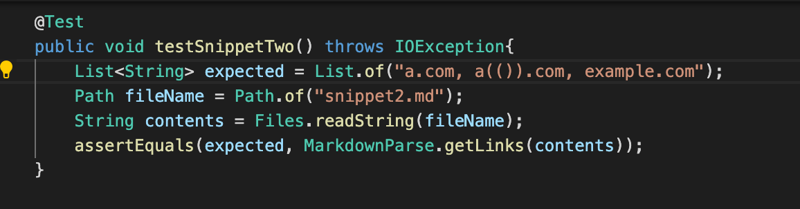
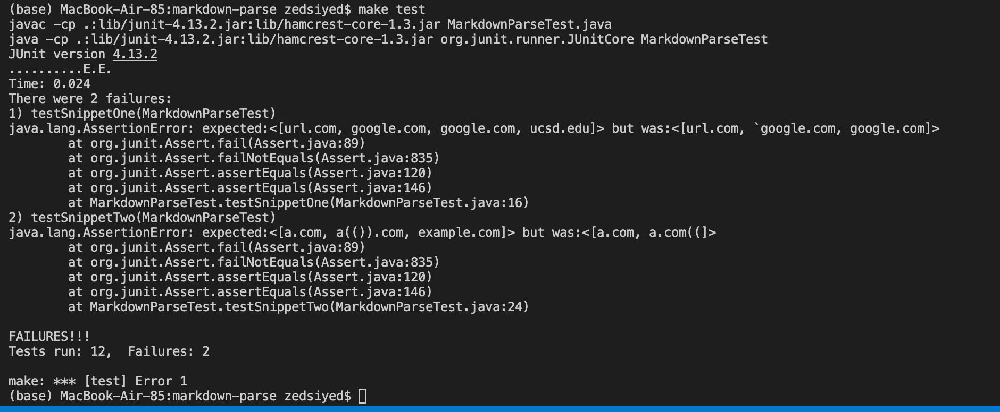
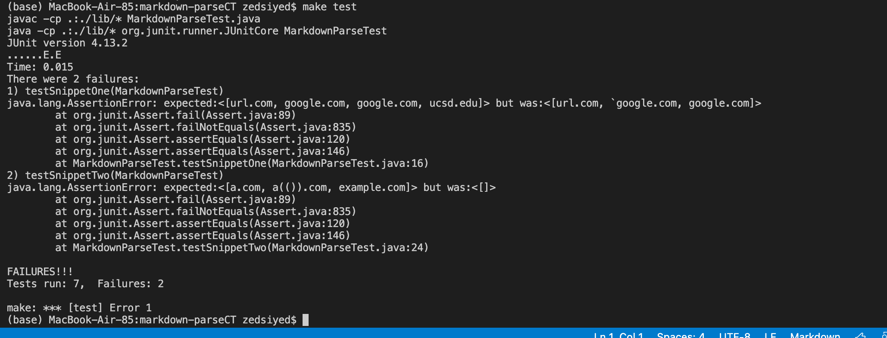
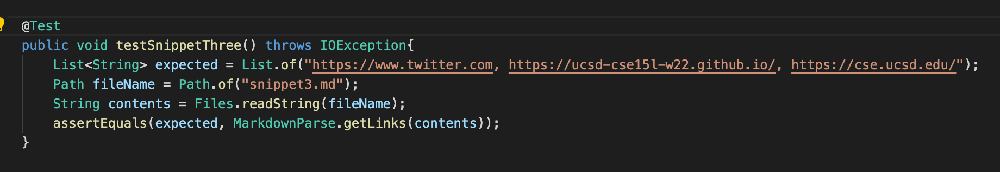
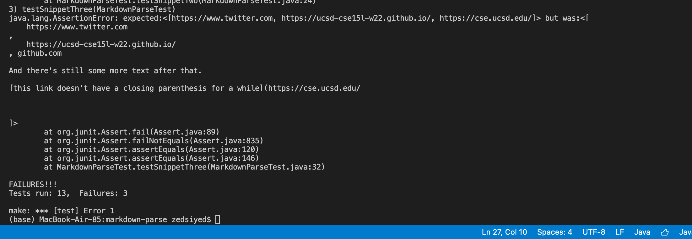

# Week 8 Lab Report

Zed Siyed

***
## Snippet One ##

[Markdown-Parse](https://github.com/zsiyed/markdown-parse)

[Reviewed Markdown-Parse](https://github.com/christopherthomason/markdown-parse)

For snippet one, this is the code I wrote to test it along with adding the text in a text file, the expected output is stored in variable expected

Using "make test" I ran the code in my file which failed the test:

Using "make test" I ran the code in the file that I reviewed which failed the test:

***
## Snippet Two ##

For snippet two, this is the code I wrote to test it along with adding the text in a text file, the expected output is stored in variable expected

Using "make test" I ran the code in my file which failed the test:

Using "make test" I ran the code in the file that I reviewed which failed the test:

***

## Snippet Three ##

For snippet three, this is the code I wrote to test it along with adding the text in a text file, the expected output is stored in variable expected

Using "make test" I ran the code in my file which failed the test:

Using "make test" I ran the code in the file that I reviewed which failed the test:

***

## Question 1 ##
Yes, a loop that first goes through the program and removes all back ticks would work

## Question 2 ##
An additional if statement that checks if open and close parentheses are one after another would do a good job of handling this situation

## Question 3 ##
Yes, a loop that first goes through the program and removes all line breaks ("\n") would work