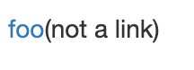

# Week 10 Lab Report

Zed Siyed
[Markdown-Parse](https://github.com/zsiyed/markdown-parse)

***
## Finding Differences ##

 Unfortunately, I did not feel confident enough making a bash script to find differences and opted to search manually.
 I tried to find potential issues by looking at the test files, and evaluating if the test seemed tricky, so that I could get through files quickly instead of having to test every single one. Overall, the process was very long but I did find 2 tests with different outputs.

***
## Differene One ##

The first issue I found was in `512.md` which looks like this:

I then ran the code on my file using Javac and got the following output:

I then ran the code on the given file using Javac and got the following output:

The correct output which is outlined by commonmark.js website is to have no valid link as shown below:

As you can see, my code and the given code have different outputs. I believe my code is the correct implementation because it matches with the commonmark.js website. The difference is shown here in my code that openParen must be right after the first closed bracket. However, the given code does not have this requirement.

Here I show which code caused this issue.

and here is the different code from the given MarkdownParse

***

## Differene Two ##

The second issue I found was in `567.md` which looks like this:

I then ran the code on my file using Javac and got the following output:

I then ran the code on the given file using Javac and got the following output:

The correct output which I figured out using the Commonmark.js site is supposed to be:

As you can see, they have different outputs. I believe the correct implementation is neither for
this case because as you can see, neither output matches with what the commonmark.js gives us. 
This is because neither implementation is designed to handle links given by footnotes, which is the special case for this test. 

There is no code to show for this portion because the bug is created by missing code, not incorrect code. The code needs to be able to handle the format of the footnotes.

However, a difference in our code is that the new implementation stopped the program when it couldn't find an open paren caused by the code below. My program did not have this which is what caused out different outputs because my code didn't terminate at that point.

***