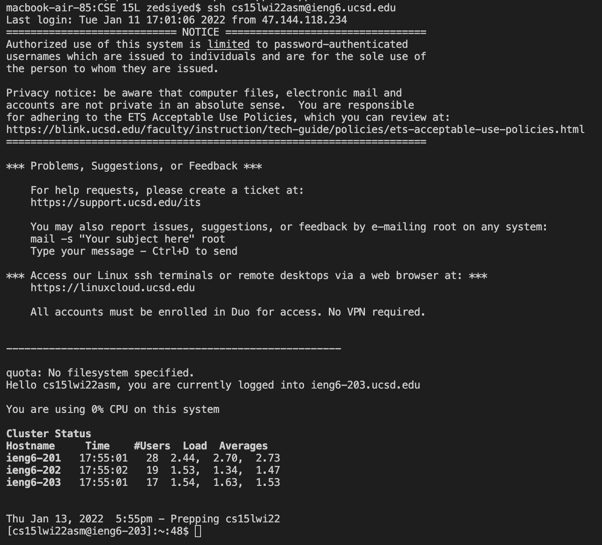

# how to log into a course-specific account on ieng6
1. The first step is **install VSCode**


2. The second step is to go to [link] (https://sdacs.ucsd.edu/~icc/index.php) to get your
account details and in terminal type 

```
ssh cs15lwi22@ieng6.ucsd.edu
```

3. Step 3 is to try some commands like the following:

```
$ cd
$ cd ~
$ ls
$ ls -a
$ ls -lat
$ mkdir newDir
```


- You can also log out with command D
- Or you can log out with the command 'exit'

4. Step 4 is to create a file with code and then move it doing the following:

```
scp WhereAmI.java cs15lwi22zz@ieng6.ucsd.edu:~/
```

- then ssh again and ls to see the file in your directory


5. Step 5 is to increase the speed of copying a file, logging in, and running using an empty password doing the following:

```
- on client type:
$ ssh-keygen
- hit enter when prompted for a file to save in order to save in home directory
- hit enter twice when promted for passwords

- ssh again and enter previous password, make a directory called .ssh then logout
$ mkdir .ssh
- copy the file to the server
$ scp /Users/zed/.ssh/id_rsa.pub cs15lwi22asm@ieng6.ucsd.edu:~/.ssh/authorized_keys

```


6. Step 6 is to optimize running remotely
- For example you can run a command remotely by putting it in quotes after you ssh
- You can also run multiple commands at once by separating them with a colon
