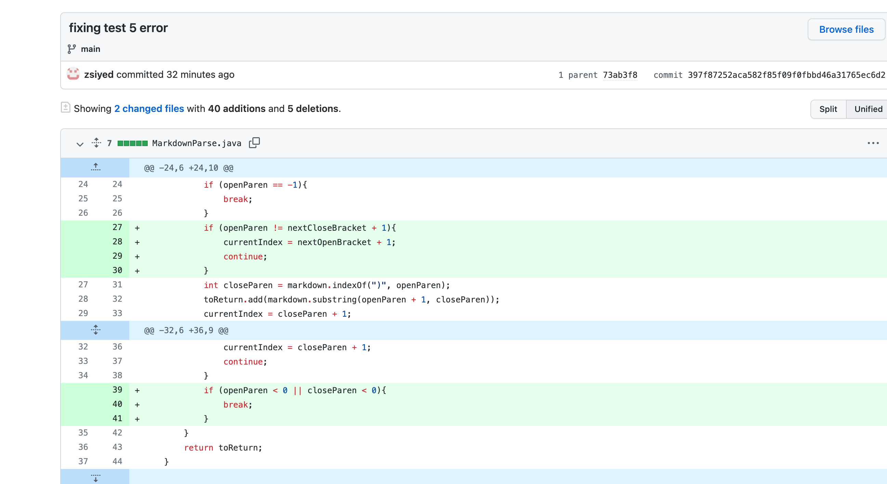

# Debugging and Testing Lab
## Here is the first test I debugged: Test 2
This is the code file of test 2, the failure inducing input: [Test 2](https://github.com/ucsd-cse15l-w22/markdown-parse/blob/main/test-file2.md)

Here is the symptom of the failure inducing input:

Here is the code changed that fixed it:

- This symptom showed me that I was not exiting some loop because my terminal would keep giving me the same infinite output my print statements.
- The input was failure inducing because the file had additional text after the end of the link, causing my loop to continue looking
for links in that additional text, and never exiting the loop.
- The bug was fixed when I made sure the loop broke when another open bracket could not be found

------------------------------------------------------------------------------------------------------------------------------------------
## Here is the next test I debugged: Test 3
This is the code file of test 3, the failure inducing input: [Test 3](https://github.com/ucsd-cse15l-w22/markdown-parse/blob/main/test-file3.md)

Here is the symptom of the failure inducing input:

Here is the code changed that fixed it:

- This symptom showed me that I was returning -1 for some value, and -1 trigger a StringIndexOutOfBoundsException
- The input was failure inducing because the file had open brackets, which cause the program to search from open parentheses, and the
program did not to move on if it could not find open parentheses. Instead, it returned -1 to show it could not find open parentheses.
- The bug was fixed when I made sure the loop broke when open parentheses could not be found

------------------------------------------------------------------------------------------------------------------------------------------
## Here is the final test I debugged: Test 5
This is the code file of test 5, the failure inducing input: [Test 5](https://github.com/ucsd-cse15l-w22/markdown-parse/blob/main/test-file5.md)

Here is the symptom of the failure inducing input:

Here is the code changed that fixed it:

- This symptom showed me that I was returning returning a link when there were no valid links to be returned
- The input was failure inducing because the file had open brackets, and then open parentheses, but the parentheses were not directly after the open bracket as they should be. This made the program find the open parentheses as see it as a valid link, and therefore return it when it shouldnt be returned
- The bug was fixed when I made sure the open parentheses had to be found directly after the open brackets.